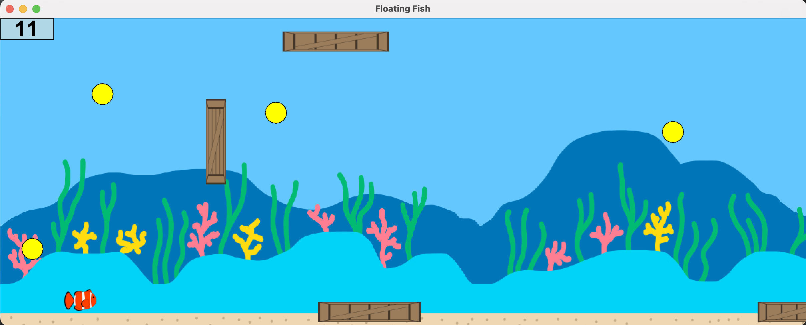

# Floating Fish

## Project Description

A simple side-scrolling endless runner game themed around the ocean. The purpose of this project was to teach a friend
the fundamentals of Java and the Java Swing library. This game demonstrates design elements such as type hierarchies, 
polymorphism, and abstract classes. It also shows how to implement a GUI and register key inputs to control the game.
Ultimately this project facilitated the learning of how to design and develop a Java application from the ground up.

All images were drawn by me.

